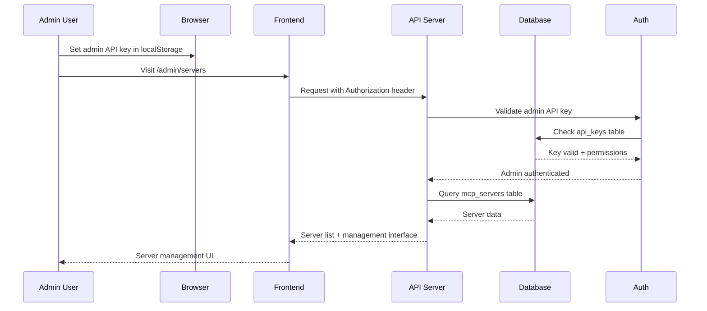
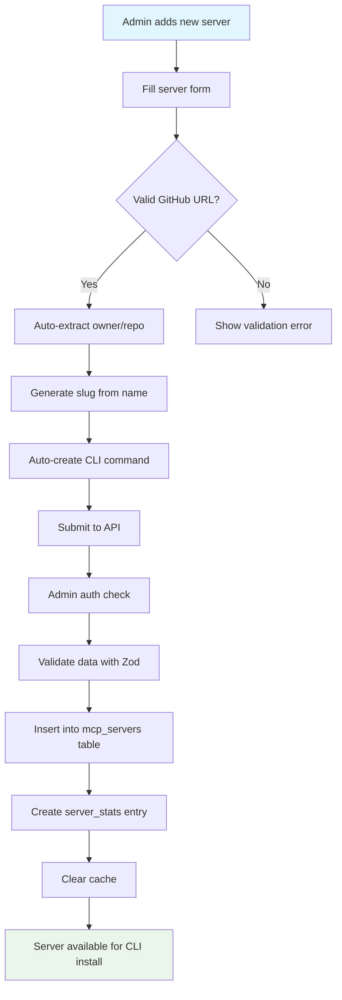
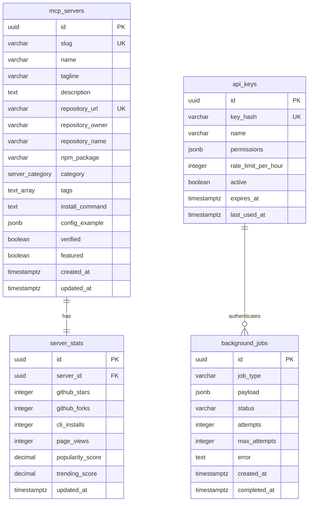
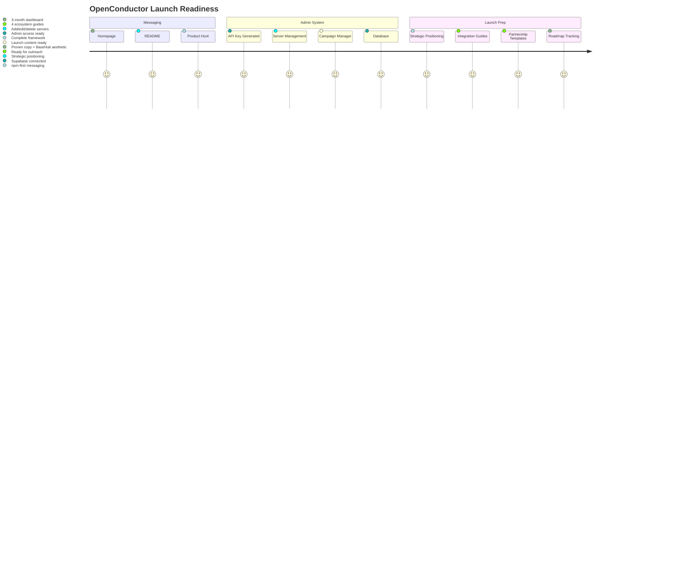
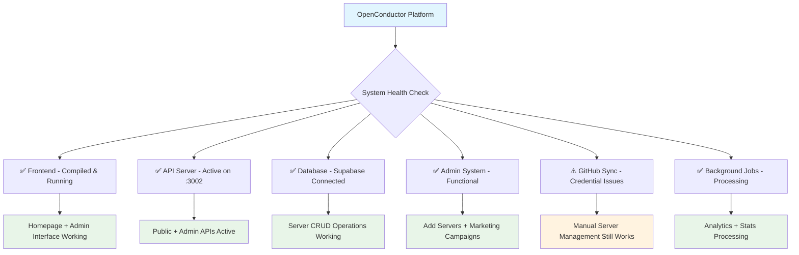

# OpenConductor - Current System Architecture

> **Complete system overview showing how everything is wired together**

## 🏗️ **Overall System Architecture**

```mermaid
graph TB
    subgraph Frontend[Frontend - Next.js :3000]
        Homepage[Homepage<br/>BaseHub Aesthetic + npm Messaging]
        Discover[/discover - Server Browser]
        AdminDash[/admin - Admin Dashboard]
        AdminServers[/admin/servers - Server Management]
        AdminMarketing[/admin/marketing - Campaign Manager]
        AdminRoadmap[/admin/roadmap - 3-Month Tracker]
        EcoPages[Ecosystem Pages<br/>/vercel /supabase /v0 /basehub]
    end
    
    subgraph API[API Server - Express :3002]
        PublicAPI[/v1/servers - Public API]
        AdminAPI[/v1/admin - Admin API]
        Auth[Admin Auth Middleware]
        Routes[Server Routes]
    end
    
    subgraph Database[Database Layer]
        Supabase[(Supabase PostgreSQL<br/>✅ Connected)]
        Tables[(Tables:<br/>• mcp_servers<br/>• server_stats<br/>• api_keys<br/>• background_jobs)]
        Redis[(Redis Cache<br/>⚠️ Local/Optional)]
    end
    
    subgraph Workers[Background Workers]
        GitHubSync[GitHub Sync Worker<br/>⚠️ Credential Issues]
        JobProcessor[Background Job Processor<br/>✅ Active]
    end
    
    Frontend --> API
    API --> Database
    API --> Workers
    Auth --> Tables
    
    style Frontend fill:#e1f5fe
    style API fill:#f3e5f5
    style Database fill:#e8f5e8
    style Workers fill:#fff3e0
```

## 🔑 **Authentication & Admin Flow**



## 📦 **Server Management Workflow**



## 🎯 **Marketing Campaign System**

```mermaid
graph LR
    subgraph Templates[Campaign Templates]
        PH[Product Hunt Template]
        TW[Twitter Thread Template]
        LI[LinkedIn Template]
        PT[Partnership Template]
    end
    
    subgraph Campaigns[Active Campaigns]
        Launch[Saturday Launch Campaign]
        Social[Social Media Campaign]
        Partnership[Partnership Outreach]
    end
    
    subgraph Schedule[Launch Week Schedule]
        Sat[Sat: Product Hunt + npm messaging]
        Sun[Sun: Ecosystem integration]
        Mon[Mon: Stack workflows]
        Tue[Tue: Platform benefits]
        Wed[Wed: Metrics sharing]
        Thu[Thu: Partnership news]
        Fri[Fri: Strategic vision]
    end
    
    Templates --> Campaigns
    Campaigns --> Schedule
    
    style Templates fill:#f3e5f5
    style Campaigns fill:#e8f5e8
    style Schedule fill:#fff3e0
```



## 📊 **Database Schema Current State**



## 🌐 **API Endpoints Currently Active**

```mermaid
graph LR
    subgraph PublicAPI[Public API - /v1/]
        Servers[/servers - List/search servers]
        Categories[/categories - Server categories]
        Stats[/stats - Platform statistics]
    end
    
    subgraph AdminAPI[Admin API - /v1/admin/]
        AdminServers[/servers - CRUD operations]
        AdminVerify[/servers/:id/verify]
        AdminFeature[/servers/:id/feature]
        AdminBulk[/servers/bulk-import]
        AdminStats[/stats - Admin dashboard]
    end
    
    subgraph Auth[Authentication]
        Anonymous[Anonymous - Rate limited]
        APIKey[API Key - Higher limits]
        AdminKey[Admin Key - Full access]
    end
    
    PublicAPI --> Anonymous
    PublicAPI --> APIKey
    AdminAPI --> AdminKey
    
    style PublicAPI fill:#e1f5fe
    style AdminAPI fill:#f3e5f5
    style Auth fill:#fff3e0
```

## 🚀 **Current Launch Status**



## ⚡ **Current System Status**



## 🎯 **Your Admin Control Panel**

**Database:** ✅ **Fully operational** - You can add servers that install in 3 commands  
**Admin Interface:** ✅ **Ready** - Complete server and marketing management  
**Launch Materials:** ✅ **Complete** - All messaging and campaigns prepared  
**Ecosystem Strategy:** ✅ **Implemented** - Progressive positioning framework active  

**Ready for Saturday launch with complete admin control!**