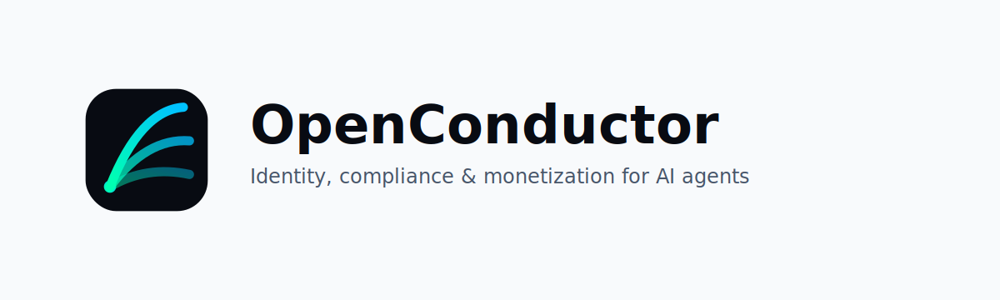

<p align="center">
  <picture>
    <source media="(prefers-color-scheme: dark)" srcset="assets/brand/banner-dark.svg">
    <source media="(prefers-color-scheme: light)" srcset="assets/brand/banner-light.svg">
    
  </picture>
</p>

<p align="center">
  <strong>The identity and compliance layer for the agent economy.</strong><br/>
  220+ MCP servers. On-chain agent identity (ERC-8004). EU AI Act compliance. Agent monetization.<br/>
  The infrastructure SaaS&#x2192;AaaS needs to go mainstream.
</p>

<p align="center">
  <a href="https://www.npmjs.com/package/@openconductor/cli"></a>
  <a href="https://www.npmjs.com/package/@openconductor/cli"></a>
  <a href="https://github.com/epicmotionSD/openconductor/stargazers"></a>
  <a href="https://github.com/epicmotionSD/openconductor/blob/main/LICENSE"></a>
</p>

<p align="center">
  <a href="https://openconductor.ai">Website</a> •
  <a href="#trust-stack">Trust Stack</a> •
  <a href="#quick-start">Quick Start</a> •
  <a href="https://openconductor.ai/discover">Browse 220+ Servers</a> •
  <a href="https://openconductor.ai/register">Register an Agent</a> •
  <a href="https://discord.gg/openconductor">Discord</a>
</p>

---

## The Agent Economy Needs Infrastructure

Jensen Huang called it at GTC 2026: **every company becomes an agent company.** SaaS becomes AaaS. OpenClaw is building the operating system for personal AI. NemoClaw secures the network connection.

**But who secures the identity?** Who's liable when an agent acts? Who ensures EU AI Act compliance? Who handles monetization?

That's OpenConductor. We're building **Trust Stack** — the identity, compliance, and monetization layer that makes agents enterprise-ready, regulator-ready, and insurable.

| Layer | What It Does | Status |
|-------|-------------|--------|
| **Registry** | 220+ MCP servers indexed. Discovery, installation, stacks. | ✅ Live |
| **Identity** | ERC-8004 on-chain agent identity. Verifiable, auditable, portable. | ✅ Live on Base Sepolia |
| **Governance** | Policy engine, permission management, attestation framework. | Q2 2026 |
| **Compliance** | EU AI Act readiness, ISO 42001, audit trails, insurance API. | Q3 2026 |
| **Monetization** | `requirePayment()` middleware, usage metering, Stripe billing. | ✅ Billing live |

> **The analogy:** OpenClaw built the highway. NemoClaw built the traffic rules. OpenConductor is the DMV — registration, licensing, insurance, accountability.

---

## OpenClaw + Trust Stack

OpenConductor sits on top of the OpenClaw ecosystem as the compliance and identity layer. Any OpenClaw agent can be wrapped with Trust Stack to get:

- **On-chain identity** via ERC-8004 — verifiable agent registration
- **EU AI Act compliance metadata** — ready for August 2026 enforcement
- **Audit trails** — immutable operation logging
- **Monetization** — one-line payment middleware for agent actions
- **Trust scores** — algorithmic reputation from attestations

```bash
npm install @openconductor/openclaw-trust-stack
```

```typescript
import { TrustStack } from '@openconductor/openclaw-trust-stack';

// Wrap any OpenClaw agent with identity and compliance
const agent = TrustStack.wrap(myOpenClawAgent, {
  identity: { name: 'My Agent', owner: '0x...', category: 'productivity' },
  compliance: { euAiAct: true, riskLevel: 'limited' },
  monetization: { perAction: 0.01, currency: 'USD' }
});

// Agent now has verifiable identity, compliance metadata, and billing
await agent.register(); // On-chain ERC-8004 registration
```

---

## See the Difference

**Before** — Edit `claude_desktop_config.json` manually:

```json
{
  "mcpServers": {
    "github": {
      "command": "npx",
      "args": ["-y", "@modelcontextprotocol/server-github"],
      "env": { "GITHUB_TOKEN": "..." }
    }
  }
}
```

Complex. Error-prone. Manual editing.

**After** — One command:

```bash
openconductor install github-mcp
```

Done in 10 seconds.

---

## Quick Start

```bash
# Install the CLI
npm install -g @openconductor/cli

# Install your first MCP server
openconductor install github-mcp

# Or install a complete stack
openconductor stack install coder
```

---

## Stacks

Pre-configured workflows in one command. Each stack includes servers + a system prompt that turns Claude into a specialized assistant.

### Coder Stack

Build, debug, and deploy like a senior engineer.

```bash
openconductor stack install coder
```

### Writer Stack

Research, write, and publish with confidence.

```bash
openconductor stack install writer
```

### Essential Stack

Everything you need to get started.

```bash
openconductor stack install essential
```

[Browse all stacks →](https://openconductor.ai/stacks)

---

## Commands

```bash
# Discovery
openconductor discover [query]      # Search 180+ servers

# Installation
openconductor install <server>      # Install a single server
openconductor stack install <name>  # Install a complete stack

# Management
openconductor list                  # Show installed servers
openconductor remove <server>       # Remove a server
openconductor update                # Update all servers
openconductor init                  # Initialize config
openconductor badge <server>        # Generate install badge
openconductor achievements          # View achievements
openconductor analytics             # Analytics preferences
```

---

## Works With

| Client         | Status          |
| -------------- | --------------- |
| Claude Desktop | ✅ Full support |
| Cursor         | ✅ Full support |
| Cline          | ✅ Full support |
| Windsurf       | ✅ Full support |
| Continue       | 🔜 Coming soon  |

---

## Why OpenConductor?

|                      |   Manual Config   |   OpenConductor    |
| -------------------- | :---------------: | :----------------: |
| Edit JSON files      |    ❌ Required    |      ✅ Never      |
| Remember syntax      |   ❌ Every time   |     ✅ Handled     |
| Multi-client support | ❌ Configure each |    ✅ Automatic    |
| Discover servers     | ❌ Google around  | ✅ Built-in search |
| Pre-built workflows  |      ❌ DIY       |     ✅ Stacks      |
| Time to install      |      ~5 min       |      ~10 sec       |

---

## 180+ Servers

The largest registry of MCP servers, all verified and tested.

| Category             | Examples                                       |
| -------------------- | ---------------------------------------------- |
| **Developer Tools**  | github, gitlab, postgres, redis, docker        |
| **Productivity**     | notion, slack, linear, todoist, google-drive   |
| **Memory & RAG**     | mcp-memory, mem0, knowledge-graph, qdrant      |
| **Web & Browser**    | puppeteer, playwright, firecrawl, brave-search |
| **AI & LLMs**        | openai, replicate, huggingface                 |
| **Data & Analytics** | bigquery, snowflake, dbt                       |

[Browse all servers →](https://openconductor.ai/discover)

---

## Add Your Server

Submit a PR to add your server to the registry.

---

## Roadmap

- [x] CLI for MCP server installation
- [x] 220+ server registry
- [x] Multi-client support (Claude, Cursor, Cline)
- [x] Pre-configured Stacks with system prompts
- [x] ERC-8004 agent identity (on-chain, Base Sepolia)
- [x] Agent registration UI with wallet connect
- [x] Subgraph indexer (The Graph)
- [x] Stripe billing integration
- [ ] OpenClaw Trust Stack integration package
- [ ] `requirePayment()` monetization middleware
- [ ] AP2 policy engine (governance)
- [ ] EU AI Act compliance tooling (August 2026 deadline)
- [ ] Base mainnet deployment
- [ ] Agent marketplace with trust scores
- [ ] Insurance API for agent operations

---

## Contributing

```bash
git clone https://github.com/epicmotionSD/openconductor.git
cd openconductor
npm install
npm run dev
```

See [CONTRIBUTING.md](./CONTRIBUTING.md) for guidelines.

---

## Community

- 🌐 [Website](https://openconductor.ai)
- 💬 [Discord](https://discord.gg/openconductor)
- 🐦 [Twitter/X](https://twitter.com/openconductor)
- 🐛 [Issues](https://github.com/epicmotionSD/openconductor/issues)

---

## Resources

- ⭐ [Awesome MCP](https://github.com/epicmotionSD/awesome-mcp) - Curated list of 220+ MCP servers, tools, and resources
- 📖 [MCP Specification](https://spec.modelcontextprotocol.io/) - Official Model Context Protocol docs
- 📚 [OpenConductor Guides](https://openconductor.ai/docs) - Tutorials and integration guides
- 🎓 [MCP Quickstart](https://modelcontextprotocol.io/quickstart) - Get started in 5 minutes- ðŸ" [Trust Stack](https://openconductor.ai/trust-stack) - Agent identity and compliance infrastructure
- ðŸ"— [ERC-8004 Contract](https://sepolia.basescan.org/address/0xf8d7044d657b602194fb5745c614beb35d5d898a) - On-chain agent registry
- ðŸ"Š [Subgraph](https://thegraph.com/studio/subgraph/openconductor/) - Query agent data via GraphQL
---

## License

MIT © [OpenConductor](https://openconductor.ai)

---

<p align="center">
  <sub>The identity, compliance, and monetization layer for the agent economy.</sub>
</p>

