# OpenConductor

> **The npm for MCP Servers**

Discover and install Model Context Protocol servers in seconds. OpenConductor is the missing registry and CLI for the AI agent ecosystem.

```bash
# Install any MCP server in 3 commands
npm install -g @openconductor/cli
openconductor discover "memory"  
openconductor install openmemory
```

[](https://www.npmjs.com/package/@openconductor/cli)
[](https://www.npmjs.com/package/@openconductor/cli)
[](https://github.com/openconductor/openconductor)
[](https://discord.gg/openconductor)

---

## 🚀 **What is OpenConductor?**

**The Problem:** There are 100+ amazing MCP servers, but finding and installing them is painful. Most developers use 2-3 when they could use 10+.

**The Solution:** OpenConductor makes MCP servers as easy to discover and install as npm packages.

### **Before OpenConductor:**
```bash
# Find server manually on GitHub
# Read installation docs  
# Copy/paste config to claude_desktop_config.json
# Debug port conflicts
# Restart Claude Desktop
# Hope it works 🤞
```

### **After OpenConductor:**
```bash
openconductor install openmemory
# ✓ Found server
# ✓ Installed package  
# ✓ Added to Claude config
# ✓ Allocated port automatically
# ✓ Ready to use!
```

---

## ⚡ **Quick Start**

### **Installation**
```bash
npm install -g @openconductor/cli
```

### **Discovery**
```bash
# Browse all servers
openconductor discover

# Search for memory servers
openconductor discover "memory"

# Filter by category
openconductor discover --category database

# Show only verified servers
openconductor discover --verified
```

### **Installation**
```bash
# Install any server
openconductor install openmemory

# See what's installed  
openconductor list

# Remove a server
openconductor remove openmemory
```

### **That's it!** 🎉

No config files to edit. No ports to manage. No Claude Desktop restarts to remember.

---

## 🔥 **Featured MCP Servers**

| **Server** | **Category** | **Description** | **Stars** |
|------------|--------------|-----------------|-----------|
| [**OpenMemory**](https://openconductor.ai/servers/openmemory) | 🧠 Memory | Hierarchical memory for AI agents | ⭐ 1.6K |
| [**GitHub MCP**](https://openconductor.ai/servers/github-mcp) | 🔌 API | Repository management and automation | ⭐ 1.1K |
| [**PostgreSQL MCP**](https://openconductor.ai/servers/postgresql-mcp) | 🗄️ Database | Secure database queries | ⭐ 654 |
| [**Filesystem MCP**](https://openconductor.ai/servers/filesystem-mcp) | 📁 Files | Sandboxed file operations | ⭐ 892 |
| [**Slack MCP**](https://openconductor.ai/servers/slack-mcp) | 💬 Communication | Workspace messaging | ⭐ 789 |

[**→ Browse all 127+ servers**](https://openconductor.ai/discover)

---

## 🎯 **Why OpenConductor?**

### **🔍 Smart Discovery**
- **Search 127+ servers** by name, category, or functionality
- **Trending analysis** shows what's gaining popularity
- **Verified servers** marked by community review
- **Smart suggestions** help you find the right tools

### **⚡ One-Command Installation**  
- **Zero configuration** - works out of the box
- **Cross-platform** - macOS, Windows, Linux support
- **Port management** - automatic conflict resolution
- **Backup safety** - auto-backup your existing config

### **🛠️ Developer Experience**
- **Interactive prompts** guide you through setup
- **Beautiful output** with progress tracking
- **Helpful errors** with troubleshooting tips  
- **Update notifications** keep your tools current

### **🌍 Community-Driven**
- **Open source** - MIT licensed, contribute freely
- **Auto-synced** - new servers appear automatically
- **GitHub native** - integrates with your workflow
- **No vendor lock-in** - works with any MCP client

---

## 🎬 **See It In Action**

### **30-Second Demo: Install & Discover**
<!-- [Demo GIF will go here] -->
*Watch the full installation and discovery workflow*

### **Live Examples**

**Memory Management:**
```bash
openconductor install openmemory
# → Hierarchical memory for your AI agents
```

**Database Operations:**
```bash  
openconductor install postgresql-mcp
# → Secure database queries and schema management
```

**File System Access:**
```bash
openconductor install filesystem-mcp  
# → Sandboxed file operations
```

**GitHub Integration:**
```bash
openconductor install github-mcp
# → Repository management and automation
```

---

## 🏗️ **How It Works**

```mermaid
graph LR
    A[👤 Developer] --> B[🔍 openconductor discover]
    B --> C[📋 Browse Registry] 
    C --> D[⚡ openconductor install]
    D --> E[✅ Ready to Use]
    
    F[📦 GitHub Repos] --> G[🤖 Auto-Sync]
    G --> H[🗄️ Registry Database]
    H --> C
```



1. **Developers discover** servers through CLI or web interface
2. **One command installs** packages and configures Claude Desktop  
3. **Background automation** keeps registry current with GitHub
4. **Community verification** ensures quality and security

---

## 🚀 **Installation Examples**

### **For AI Agent Development**
```bash
# Memory management
openconductor install openmemory

# Database access  
openconductor install postgresql-mcp

# File operations
openconductor install filesystem-mcp

# GitHub integration
openconductor install github-mcp

# Now build agents that can remember, query databases,
# manage files, and interact with GitHub!
```

### **For Data Analysis Workflows**
```bash
# Database connections
openconductor install mongodb-mcp
openconductor install postgresql-mcp  

# Search capabilities
openconductor install brave-search-mcp

# File management
openconductor install google-drive-mcp
```

### **For Team Automation**
```bash
# Communication
openconductor install slack-mcp

# Project management  
openconductor install github-mcp

# Documentation
openconductor install filesystem-mcp
```

---

## 🤝 **Contributing**

We'd love your help making OpenConductor better!

### **Add Your MCP Server**
1. Add `mcp-server` topic to your GitHub repo
2. Include installation instructions in README  
3. We'll auto-discover and index it
4. Community can find and install it instantly

### **Improve the Platform**
1. [Report bugs](https://github.com/openconductor/openconductor/issues)
2. [Suggest features](https://github.com/openconductor/openconductor/discussions)  
3. [Submit pull requests](https://github.com/openconductor/openconductor/pulls)
4. [Join our Discord](https://discord.gg/openconductor)

See [CONTRIBUTING.md](CONTRIBUTING.md) for detailed guidelines.

---

## 📊 **Community Stats**

- **🎯 127+ MCP Servers** indexed and searchable
- **⚡ 1-command installation** for any server
- **🔍 Smart discovery** with category filtering  
- **✅ Community verification** for quality assurance
- **🌐 Cross-platform support** (macOS, Windows, Linux)

---

## 💬 **Community & Support**

- **🌐 Website**: [openconductor.ai](https://openconductor.ai)
- **💬 Discord**: [Join our community](https://discord.gg/openconductor)
- **🐛 Issues**: [Report bugs](https://github.com/openconductor/openconductor/issues)
- **💡 Discussions**: [Share ideas](https://github.com/openconductor/openconductor/discussions)
- **📧 Email**: [hello@openconductor.ai](mailto:hello@openconductor.ai)

---

## 📄 **License**

MIT License - see [LICENSE](LICENSE) for details.

---

## 🙏 **Acknowledgments**

Built for the [Model Context Protocol](https://modelcontextprotocol.io) community.

Special thanks to:
- **Anthropic** for creating MCP
- **All MCP server maintainers** building the ecosystem  
- **Early OpenConductor users** providing feedback and support

---

<div align="center">

**⭐ Star this repo if OpenConductor saves you time!**

**🚀 Ready to supercharge your AI agents?**

[**Get Started →**](https://openconductor.ai)

</div>

---

*OpenConductor - Making AI agent infrastructure as easy as `npm install`*