# OpenConductor - Current System Issues & Fixes

> **Identifying and fixing connection problems**

## ❌ **Current Issues Identified**

```mermaid
graph TD
    subgraph Frontend[Frontend Next.js]
        FE_Port[Running on :3000]
        FE_Config[NEXT_PUBLIC_API_URL=3002]
        AdminPage[/admin/servers page]
        LocalStorage[localStorage access]
    end
    
    subgraph API[API Server]
        API_Expected[Expected on :3002]
        API_Actual[Actually on :3001?]
        API_Routes[/v1/admin routes]
        API_Working[Background workers active]
    end
    
    subgraph Database[Database]
        DB_Supabase[Supabase PostgreSQL]
        DB_Connected[✅ Connected]
        DB_Errors[Admin key exists]
    end
    
    FE_Config -.->|❌ Connection Refused| API_Expected
    API_Expected -.->|❌ Port mismatch| API_Actual
    AdminPage -.->|❌ SSR Error| LocalStorage
    
    API_Routes --> DB_Connected
    
    style Frontend fill:#ffe6e6
    style API fill:#fff4e6
    style Database fill:#e8f5e8
```

## 🔧 **Issues to Fix**

**Issue 1: Port Configuration Mismatch**
- Frontend expects API on :3002 
- Logs show API might be on :3001
- Connection refused errors

**Issue 2: localStorage SSR Error**
- Admin page trying to access localStorage during server-side rendering
- Causing 500 errors on `/admin/servers`

**Issue 3: API Route Configuration**
- Admin routes created but not properly connected
- Need to verify endpoint mounting

**Issue 4: Missing API Endpoint**
- `/admin/servers` route might not be registered
- Need to add to server routing

## ✅ **Current Working Components**

```mermaid
graph LR
    subgraph Working[✅ Working Systems]
        Homepage[Homepage - BaseHub design]
        Database[Database - Supabase connected]
        AdminKey[Admin API key generated]
        Marketing[Marketing campaign pages]
        Roadmap[Roadmap dashboard]
    end
    
    subgraph Issues[❌ Need Fixes]
        AdminServers[Admin server management]
        APIConnection[Frontend → API connection]
        PortConfig[Port configuration]
        SSRFix[Server-side rendering fix]
    end
    
    style Working fill:#e8f5e8
    style Issues fill:#ffe6e6
```



## 🛠️ **Fix Implementation Plan**

1. **Fix localStorage SSR issue** - Add client-side check
2. **Fix port configuration** - Update API URL to match actual port
3. **Add admin routes** - Ensure routes are properly mounted  
4. **Test admin interface** - Verify full functionality