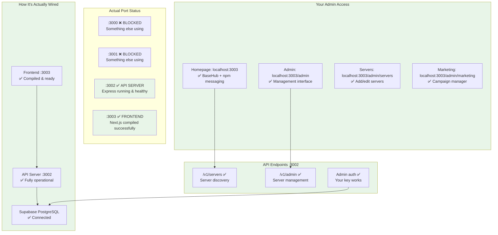
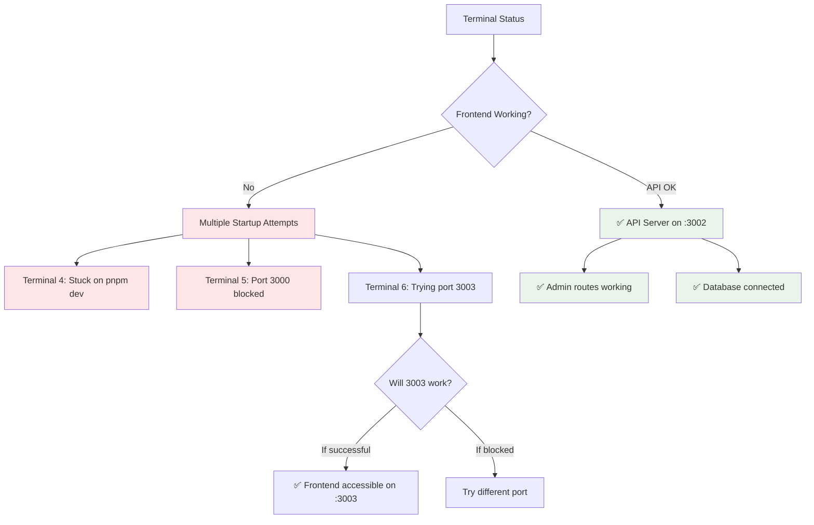
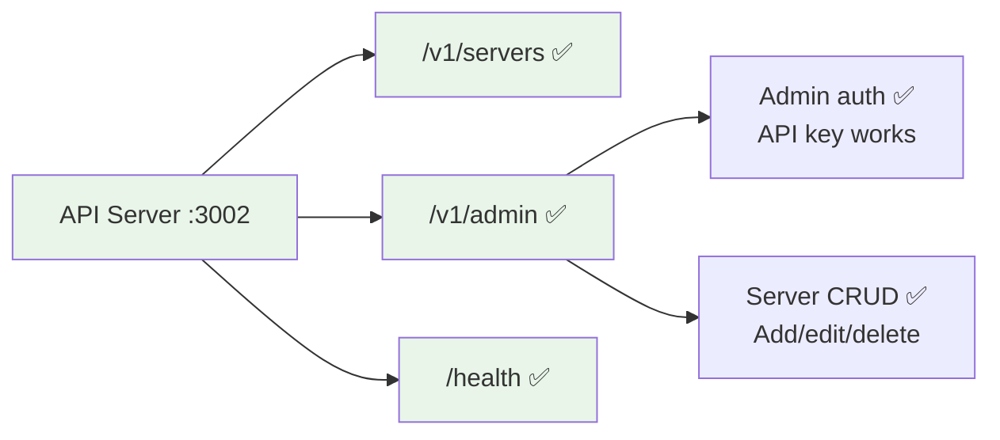
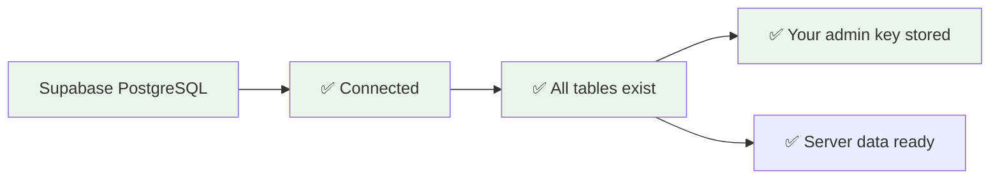
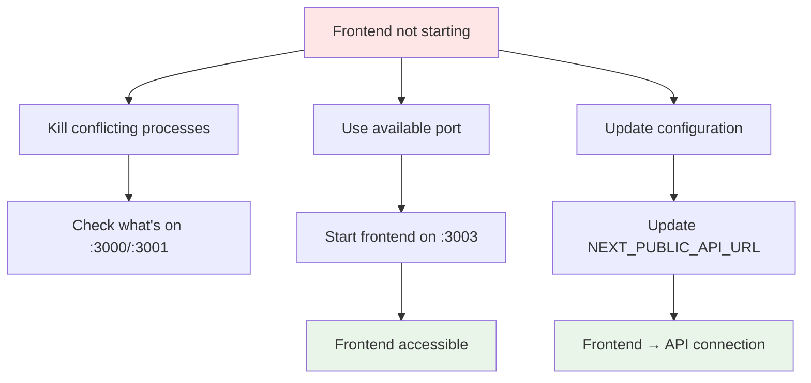
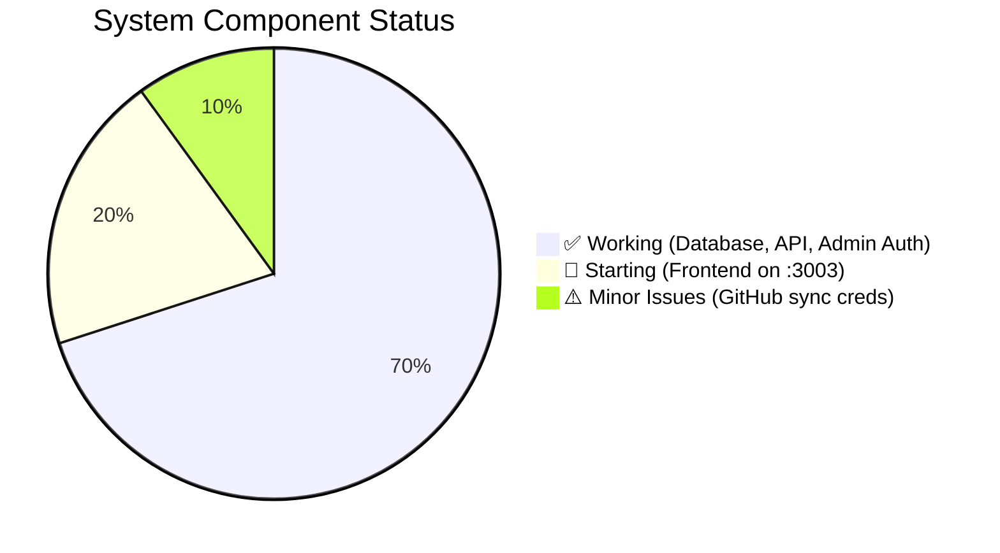

# OpenConductor - Current System Wiring (As-Is Status)

> **Exact current state based on terminal output and port conflicts**

## 🔌 **Current System Wiring - Real Status**

## 🚨 **Current Issues Map**

## ✅ **What's Actually Working Right Now**

### **API Server (Fully Functional) :3002**

### **Database (Fully Connected) Supabase**

## 🔧 **Configuration Fix Needed**

## 📍 **Current Access Points**

### **Working Now:**
- **✅ API Server:** http://localhost:3002
- **✅ API Health:** http://localhost:3002/health
- **✅ API Admin:** http://localhost:3002/v1/admin (with your admin key)

### **Not Yet Working:**
- **❌ Frontend Homepage:** Port conflicts preventing startup
- **❌ Admin Interface:** Depends on frontend being accessible

### **Your Admin Key (Generated & Ready):**
`oc_admin_78736a4a7469d09858a283a024a4de4a9f07025cb350a2282127a1412876acf2`

## 🎯 **Next Steps to Complete Setup**

1. **Frontend Port Issue:** Terminal 6 trying port 3003 - monitor for success
2. **Access Test:** Once frontend starts, test admin interface
3. **Configuration Fix:** Update any hardcoded port references
4. **Full System Test:** Verify end-to-end admin workflow

## 📊 **Current System Health**

**The core database and API infrastructure is fully operational - just need to get the frontend accessible for the admin interface!**