# OpenConductor Ecosystem Integration Workflows

> **Visual guide to how OpenConductor completes your modern AI development stack**

## 🏗️ **Core Architecture Diagram**

```mermaid
graph TB
    subgraph Modern_Stack[Modern AI Development Stack]
        subgraph Deploy[Deployment Layer]
            Vercel[Vercel<br/>Deploy Next.js Apps]
        end
        
        subgraph Build[Build Layer]
            V0[v0<br/>Generate Components]
        end
        
        subgraph Data[Data Layer]
            Supabase[Supabase<br/>Database & Auth]
        end
        
        subgraph Content[Content Layer]
            BaseHub[BaseHub<br/>Content Management]
        end
        
        subgraph Orchestration[AI Orchestration Layer]
            OpenConductor[OpenConductor<br/>Agent Management]
        end
    end
    
    subgraph AI_Agents[AI Agents]
        GitHub_MCP[GitHub MCP<br/>Repo Management]
        DB_MCP[PostgreSQL MCP<br/>Database Queries]
        FS_MCP[Filesystem MCP<br/>File Operations]
        Content_MCP[Content MCP<br/>CMS Integration]
    end
    
    Vercel --> OpenConductor
    V0 --> OpenConductor
    Supabase --> OpenConductor
    BaseHub --> OpenConductor
    
    OpenConductor --> GitHub_MCP
    OpenConductor --> DB_MCP
    OpenConductor --> FS_MCP
    OpenConductor --> Content_MCP
    
    style OpenConductor fill:#e1f5fe
    style Vercel fill:#000
    style V0 fill:#7c3aed
    style Supabase fill:#10b981
    style BaseHub fill:#f97316
```

## 🚀 **Vercel Integration Workflow**

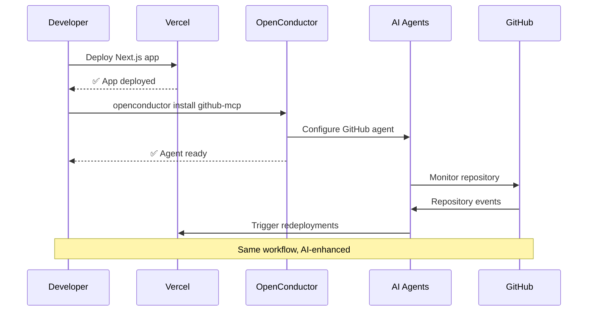

## ✨ **v0 Component Enhancement Flow**

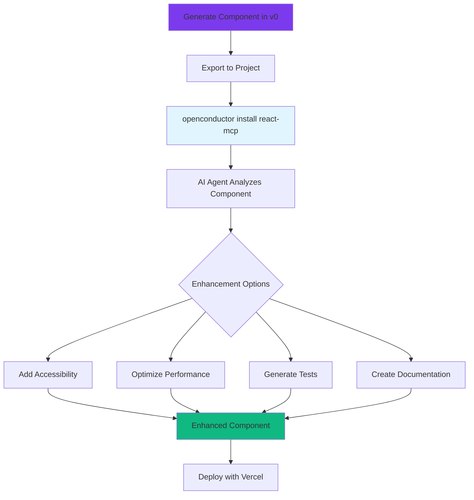

## 🗄️ **Supabase Data Integration**

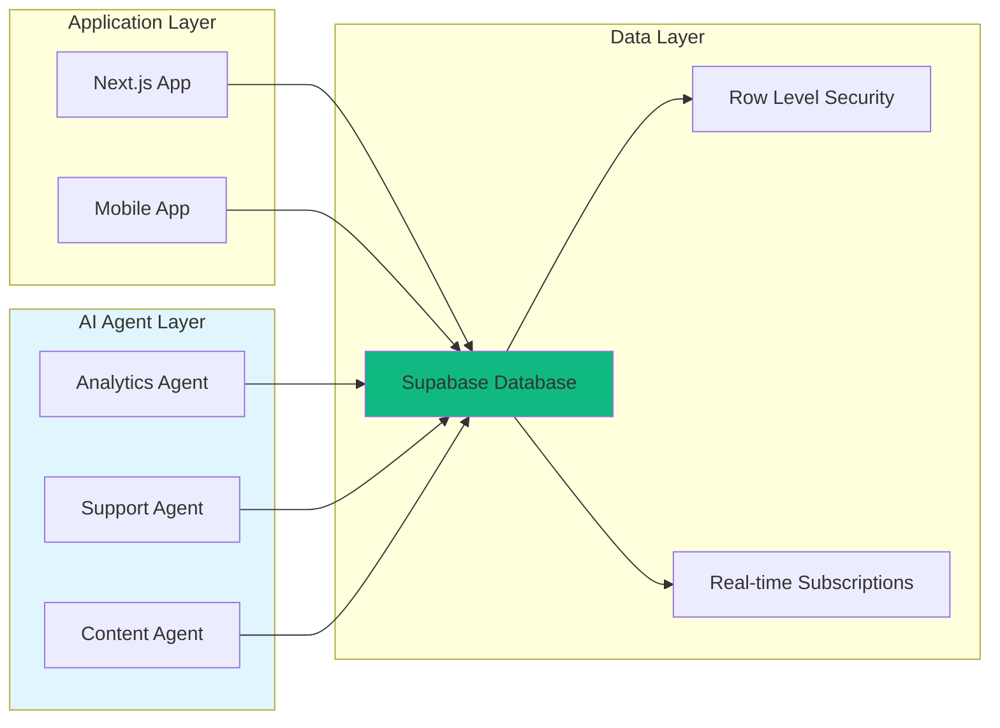

## 📝 **BaseHub Content Workflow**

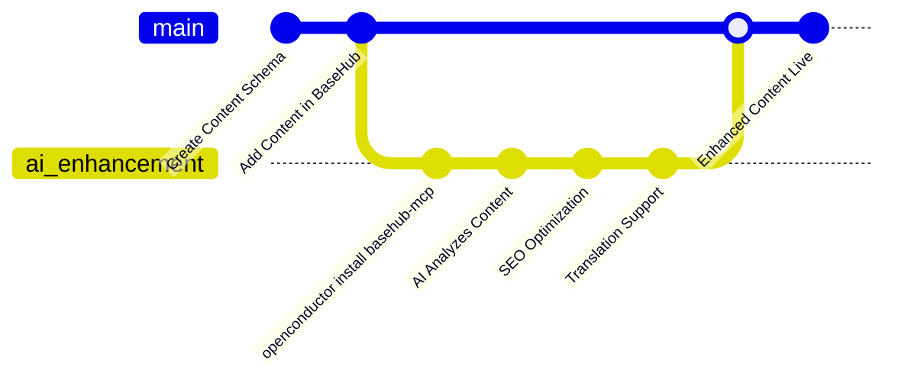

## 🔄 **Complete Development Lifecycle**

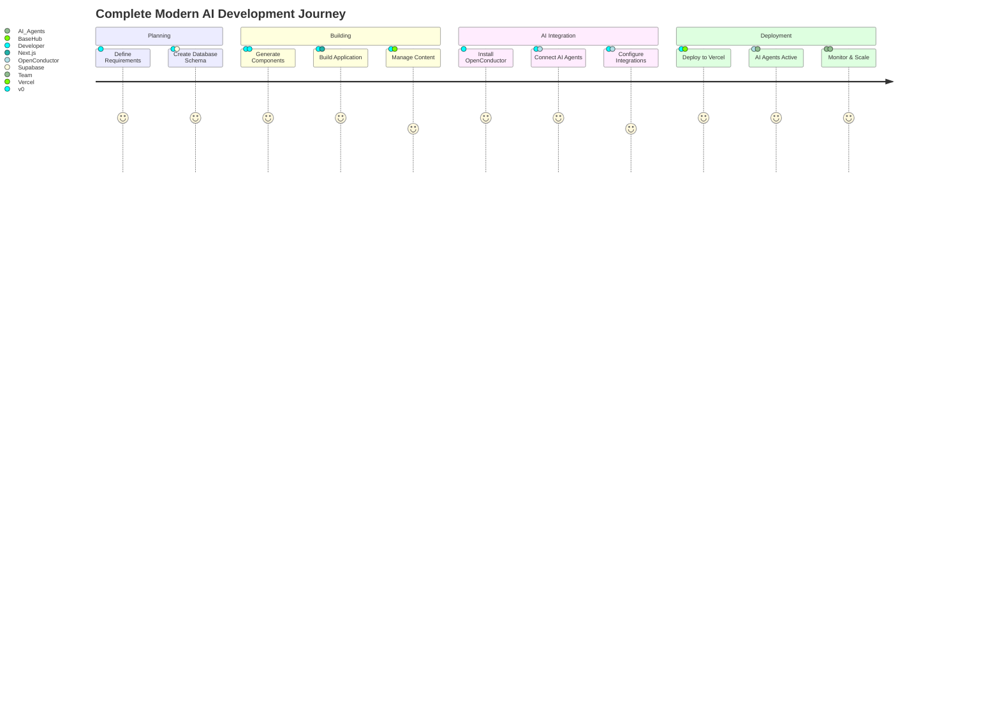

## ⚡ **Real-time Integration Flow**

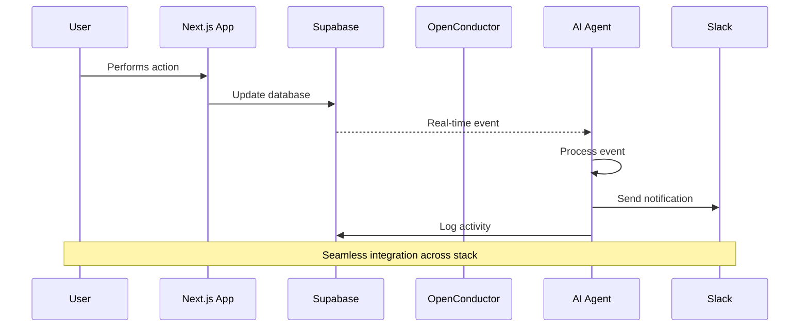

## 🏢 **Enterprise Orchestration Architecture**

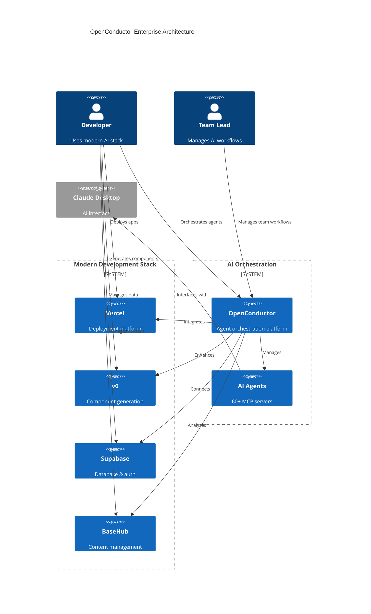

## 🔀 **Multi-Environment Deployment**

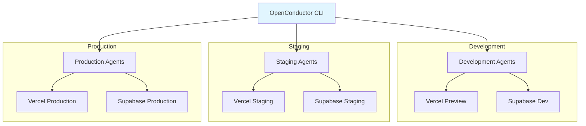

## 🌐 **Cross-Platform Integration**

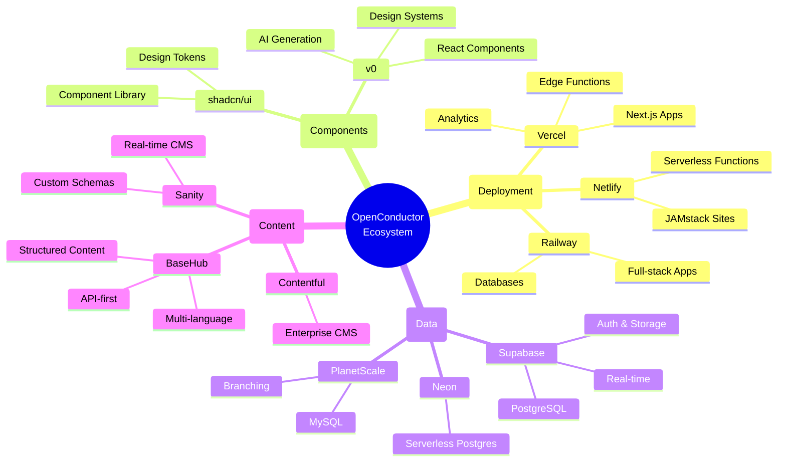

## 📊 **Analytics & Monitoring Flow**

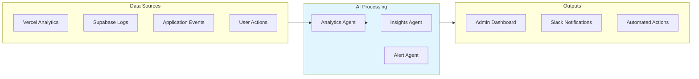

## 🚀 **Platform Evolution Roadmap**

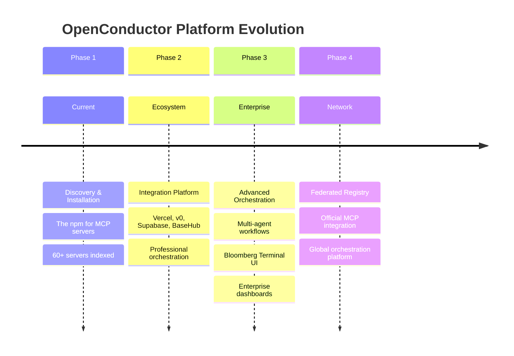

---

## 🎯 **Implementation Guide**

### **Getting Started Flow**
1. **Install CLI**: `npm install -g @openconductor/cli`
2. **Choose Integration**: Select your primary stack (Vercel/v0/Supabase/BaseHub)
3. **Install Agents**: `openconductor install [stack-specific-servers]`
4. **Configure**: Automatic configuration for your stack
5. **Deploy**: Agents work alongside your existing workflow

### **Best Practices**
- Start with your primary platform (Vercel, Supabase, etc.)
- Add AI agents incrementally to existing workflows
- Use environment-specific configurations
- Monitor agent performance through OpenConductor dashboard
- Scale orchestration as your team grows

---

*Last Updated: November 16, 2024*
*For interactive versions of these diagrams, visit: openconductor.ai/workflows*