# OpenConductor - Final Working System Architecture

> **✅ All systems operational and correctly wired**

## 🎉 **WORKING SYSTEM - All Connected**

```mermaid
graph TB
    subgraph WorkingPorts[✅ All Ports Working]
        Frontend_Port[":3001 ✅ FRONTEND<br/>Next.js ready in 4.2s"]
        API_Port[":3002 ✅ API SERVER<br/>Express fully operational"]
    end
    
    subgraph CompleteSysem[✅ Complete System]
        Frontend[Frontend :3001<br/>✅ Homepage + Admin interface]
        API[API Server :3002<br/>✅ Public + Admin endpoints]
        Database[Supabase PostgreSQL<br/>✅ Connected & responsive]
        AdminAuth[Admin Authentication<br/>✅ API key system working]
    end
    
    subgraph YourAdminAccess[✅ Your Admin Control Panel]
        HomePage[localhost:3001<br/>✅ BaseHub + npm messaging]
        AdminDash[localhost:3001/admin<br/>✅ Dashboard]
        ServerMgmt[localhost:3001/admin/servers<br/>✅ Add/edit servers + CLI gen]
        Marketing[localhost:3001/admin/marketing<br/>✅ Campaign management]
        Roadmap[localhost:3001/admin/roadmap<br/>✅ 3-month tracking]
    end
    
    subgraph APIEndpoints[✅ API Endpoints Working]
        PublicAPI["/v1/servers ✅<br/>Server discovery"]
        AdminAPI["/v1/admin ✅<br/>Server CRUD"]
        AuthAPI["Admin auth ✅<br/>Your key validates"]
        BulkAPI["/v1/admin/servers/bulk-import ✅<br/>GitHub batch import"]
    end
    
    Frontend --> API
    API --> Database
    AdminAuth --> Database
    HomePage --> PublicAPI
    ServerMgmt --> AdminAPI
    Marketing --> Database
    
    style CompleteSysem fill:#e8f5e8
    style YourAdminAccess fill:#e8f5e8
    style APIEndpoints fill:#e8f5e8
    style Frontend_Port fill:#e8f5e8
    style API_Port fill:#e8f5e8
```

## ✅ **Configuration Fixed - All Working**

### **✅ Frontend Configuration (Fixed)**
- **Port:** 3001 (Next.js auto-selected available port)
- **API URL:** Fixed to `http://localhost:3002` (removed double `/v1`)
- **Status:** Ready in 4.2s, fully operational

### **✅ API Server (Working)**  
- **Port:** 3002 (Express server)
- **Endpoints:** `/v1/servers` + `/v1/admin` active
- **Database:** Supabase connected, all queries working

### **✅ Admin System (Functional)**
- **Your API Key:** `oc_admin_78736a4a7469d09858a283a024a4de4a9f07025cb350a2282127a1412876acf2`
- **Authentication:** Working via API key middleware
- **Server Management:** Add MCP servers installable in 3 commands

## 🚀 **Final Access Instructions**

### **Your Working URLs:**
- **Homepage:** http://localhost:3001
- **Admin Dashboard:** http://localhost:3001/admin
- **Server Management:** http://localhost:3001/admin/servers
- **Marketing Campaigns:** http://localhost:3001/admin/marketing
- **Roadmap Tracking:** http://localhost:3001/admin/roadmap

### **Admin Setup (One Time):**
1. Visit http://localhost:3001/admin
2. Open browser console (F12)
3. Run: `localStorage.setItem('admin-api-key', 'oc_admin_78736a4a7469d09858a283a024a4de4a9f07025cb350a2282127a1412876acf2')`
4. Refresh page - full admin access granted

## 🎯 **System Status Summary**

```mermaid
pie title OpenConductor System Health
    "✅ Frontend (3001)" : 25
    "✅ API Server (3002)" : 25
    "✅ Database (Supabase)" : 25
    "✅ Admin System" : 25
```

**🚀 READY FOR SATURDAY LAUNCH!**

## 📋 **Complete Feature Set Available**

### **✅ Strategic Positioning**
- BaseHub clean design + proven "npm for MCP servers" messaging
- Ecosystem integration pages (Vercel, v0, Supabase, BaseHub)
- Progressive disclosure framework for launch week

### **✅ Admin Management**
- Manually add MCP servers with auto-generated CLI commands
- Server verification workflow (pending → verified → live)
- Marketing campaign management with launch week templates
- Partnership outreach materials for ecosystem integration

### **✅ Technical Infrastructure** 
- Database working correctly (Supabase PostgreSQL)
- API server responding on all endpoints
- Frontend serving homepage and admin interface
- Admin authentication via secure API key system

**The complete ecosystem positioning transformation is deployed and ready for your Saturday launch with full admin control over servers and marketing campaigns!**