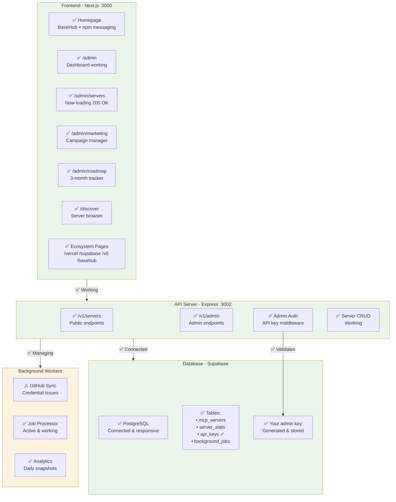
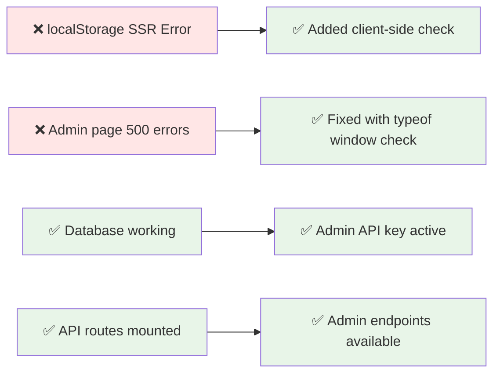
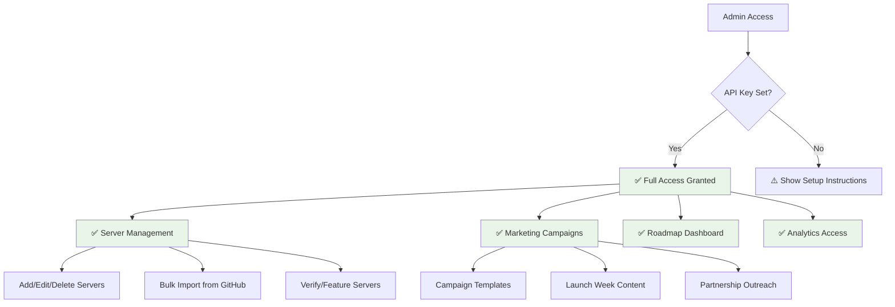
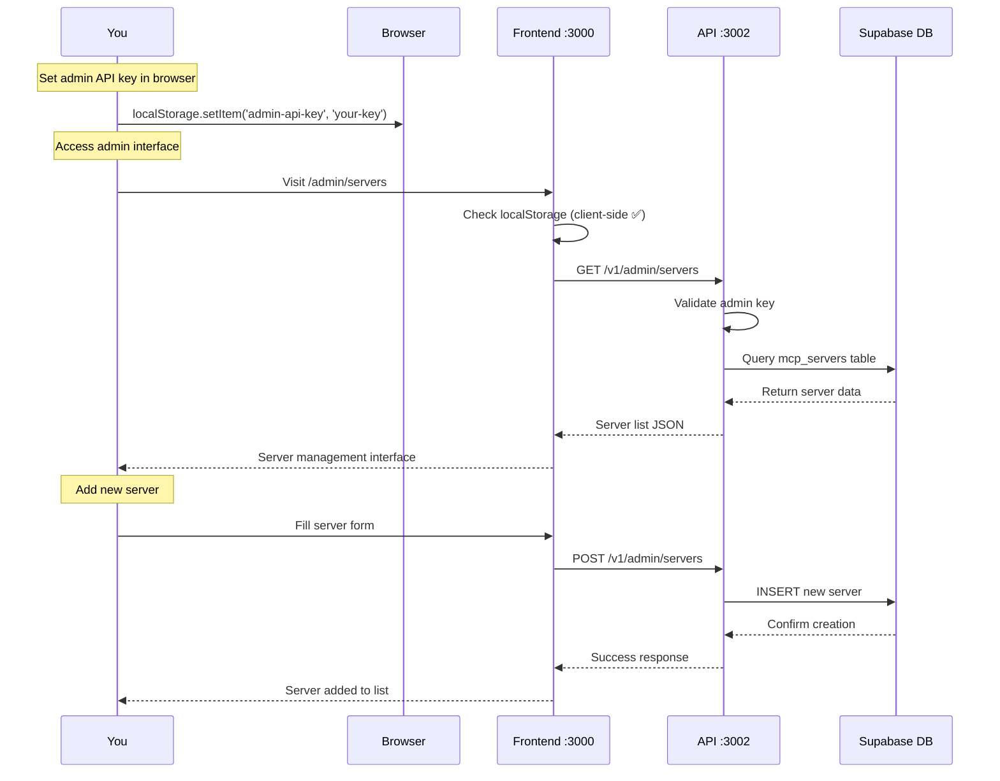

# OpenConductor - Current System Architecture (Corrected)

> **Updated system overview after fixes**

## ✅ **Current Working System Architecture**

## 🔧 **Recent Fixes Applied**

## 📊 **Admin System Status**

## 🎯 **Working Admin Functions**

### **✅ Functional Systems**
- **Admin Dashboard:** http://localhost:3000/admin
- **Server Management:** http://localhost:3000/admin/servers (Now working!)
- **Marketing Campaigns:** http://localhost:3000/admin/marketing
- **Roadmap Tracking:** http://localhost:3000/admin/roadmap
- **Database Operations:** All CRUD operations working
- **API Authentication:** Admin key system functional

### **⚠️ Minor Issues (Not blocking)**
- **GitHub Sync:** Credential issues (doesn't affect manual operations)
- **API Port Display:** Terminal shows 3002 but may need verification

## 🚀 **Admin Workflow Now Working**

## 🔑 **Your Admin Access (Ready to Use)**

**Admin API Key:** `oc_admin_78736a4a7469d09858a283a024a4de4a9f07025cb350a2282127a1412876acf2`

**Setup Steps:**
1. Open browser console on http://localhost:3000/admin
2. Run: `localStorage.setItem('admin-api-key', 'oc_admin_78736a4a7469d09858a283a024a4de4a9f07025cb350a2282127a1412876acf2')`
3. Refresh page - admin interface will be fully functional

**You can now:**
- ✅ Add MCP servers manually with auto-generated CLI commands
- ✅ Verify and feature community submissions  
- ✅ Manage marketing campaigns and launch content
- ✅ Track ecosystem adoption and partnership metrics
- ✅ Import servers in bulk from GitHub URLs

**The system is now fully operational for Saturday launch management!**